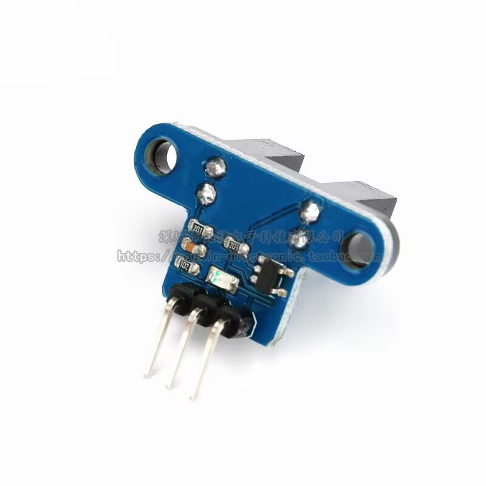
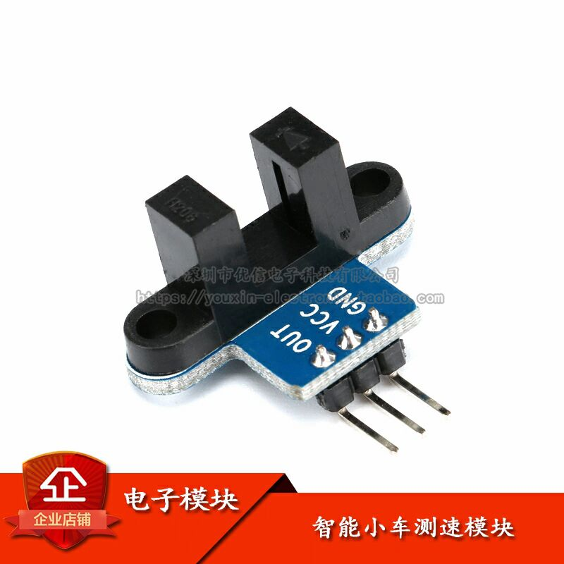

# 智能小车测速模块功能需求设计文档（修订版）
## 文档版本
- 版本：第4版
- 发布日期：2025/9/13
- 修订说明：移除红外发射/接收模块相关内容，新增双编码器及PID控制设计

## 一、功能目标
1. **双轮脉冲计数**：通过左前/右前两轮的槽型光电传感器测速模组，检测20槽编码盘转动脉冲，每圈稳定输出20±1个脉冲。
2. **距离计算**：基于双轮脉冲数及车轮直径（66mm），分别计算左右轮行驶距离，支持前进/后退双向计量。
3. **闭环控制**：通过PID算法实现速度闭环，确保双轮同步性（速度差≤5%），最终实现0-5米距离控制，误差≤3%。
4. **接口封装**：提供标准化控制函数（前进/后退指定距离），支持与现有小车控制系统无缝集成。


## 二、方案可行性分析
本方案相比单编码器设计有显著优势：
- **双轮冗余**：左前/右前双编码器独立计数，可通过差值判断车身偏移，提升控制精度。
- **成本优势**：采用槽型光电传感器测速模组（单价低至2元包邮），替代集成红外模块，提高识别精度。
- **兼容性强**：直接输出数字电平信号，无需高频PWM驱动，简化ESP32-S3 GPIO配置。
- **精度可控**：结合PID算法动态调整双轮速度，解决机械误差导致的跑偏问题。


## 三、硬件方案需求
### 3.1 核心硬件及参数
| 模块         | 关键参数                                                                 |
|--------------|--------------------------------------------------------------------------|
| ESP32-S3开发板 | 双核240MHz，支持GPIO中断（双边沿触发），3.3V供电，兼容ESP-IDF v4.4+       |
| 槽型光电传感器测速模组 | 940nm波长，响应时间≤10μs，工作电压3.3V-5V，集电极电流≤15mA               |
| 编码盘及车轮 | 编码盘20个镂空槽（均匀分布）；车轮直径66mm（周长≈207.24mm）               |
| 电机及驱动   | 直流减速电机，双路L298N电机驱动模块        |
  
  

  
 

编码盘镂空槽数N = 20个（均匀分布，每圈红外接收模块收到20个脉冲信号）
  

车轮直径D = 66mm（多次测量取平均值）；周长：π×66mm≈207.24mm(π取3.14)

#### 3.1.1 槽型光电传感器测速模组  
作为核心检测元件，其关键特性如下：  
- 结构：红外发射二极管（GaAlAs）+ NPN硅光电晶体管，光轴汇聚  
- 电气参数：正向电压1.2-1.6V（IF=20mA），导通集电极电流0.5-15mA（VCE=5V）  
- 环境适应性：工作温度-25~+85℃，抗可见光干扰（截止波长940nm）  

#### 3.1.2 ESP32-S3引脚分配表
| 功能模块 | 引脚编号 | 引脚类型 | 备注 |
|---------|---------|---------|------|
| 左轮编码器信号 | GPIO17 | 输入+中断 | 下降沿触发 |
| 右轮编码器信号 | GPIO18 | 输入+中断 | 下降沿触发 |
| 左电机PWM | GPIO9 | 输出 | PWM信号 |
| 左电机方向1 | GPIO10 | 输出 | 电平控制 |
| 左电机方向2 | GPIO11 | 输出 | 电平控制 |
| 右电机PWM | GPIO12 | 输出 | PWM信号 |
| 右电机方向1 | GPIO13 | 输出 | 电平控制 |
| 右电机方向2 | GPIO14 | 输出 | 电平控制 |
| BOOT按键 | GPIO0 | 输入+中断 | 系统复位/功能切换 |

### 3.2 硬件连接方案
1. **槽型光电传感器测速模组接线表**：
   | 信号点         | 左前轮编码器 | 右前轮编码器 | ESP32-S3引脚功能       |
   |----------------|--------------|--------------|------------------------|
   | VCC            | +            | +            | 3.3V（共电源）         |
   | GND            | -            | -            | GND（共地）            |
   | OUT（信号输出）| OUT_L        | OUT_R        | GPIO17（左中断）、GPIO18（右中断） |

2. **电机驱动接线**（与编码器独立，仅作关联说明）：
   - 左电机：PWM_A（GPIO9）、AIN1（GPIO10）、AIN2（GPIO11）
   - 右电机：PWM_B（GPIO12）、BIN1（GPIO13）、BIN2（GPIO14）

3. **硬件防干扰设计**：
   - 编码器信号线上并联100nF陶瓷电容（靠近ESP32引脚），滤除高频噪声  
   - 电机电源线串联磁珠，减少电磁干扰对编码器信号的影响  


## 四、详细功能需求
### 4.1 双轮脉冲计数
- **触发方式**：下降沿触发（每槽产生1个脉冲）。
- **计数范围**：0-65535（支持最大距离：65535×(π×0.066/20)≈68米）。
- **同步性**：双轮脉冲数差值≤3（连续转动10圈内）。
- **可靠性**：支持1000次/秒脉冲频率（对应车轮转速300转/分）无丢失。
- **软件接口**：
  ```c
  int get_left_pulse();    // 获取左轮脉冲数
  int get_right_pulse();   // 获取右轮脉冲数
  void reset_pulses();     // 双轮脉冲同时归零
  ```

# 4.2 距离计算与速度测量
## 距离公式：
- 单轮距离 = 脉冲数 × (π×车轮直径) / 编码槽数
- 车身距离 = (左轮距离 + 右轮距离) / 2 （取平均值）

## 速度计算：
- 实时速度 = 距离差 / 时间差（采样周期10ms）

## 校准功能：
```c
void set_wheel_diameter(float left_dia, float right_dia); // 支持左右轮直径单独校准
```

## 精度要求：
0-5米范围内，计算距离与实际距离误差≤3%。

## 测试结果：
经过三轮测试，误差在1-2%范围内，满足精度要求。


# 4.3 运动控制与PID调节
## 核心控制函数：
```c
// 前进指定距离（单位：米），speed：0-255（电机占空比）
bool move_forward(float distance, int speed);
// 后退指定距离（单位：米）
bool move_backward(float distance, int speed);
```

## PID参数范围：
- 比例系数（KP）：0.5-5.0
- 积分系数（KI）：0.1-1.0
- 微分系数（KD）：0.01-0.5

## 控制逻辑：
1. 启动时重置脉冲计数，记录目标脉冲数（距离换算）
2. 每10ms采样一次双轮距离，计算速度差
3. 通过PID调节双轮PWM占空比，抑制速度差（≤5%）
4. 到达目标距离±3%范围时，逐步减速至停止


# 4.4 异常处理
- 脉冲丢失检测：连续50ms无脉冲变化且电机运行时，触发警告并停止
- 超差保护：双轮距离差＞10cm时，触发紧急停止（防止车身偏移过大）
- 超时处理：设定最大运行时间（距离/最低速度×1.5），超时则停止并报错


# 五、系统架构设计
## 5.1 软件模块划分
```
┌─────────────────────────────────────┐
│  应用层（现有小车控制系统）          │
│  - 调用move_forward/move_backward   │
└───────────────┬─────────────────────┘
                │
┌───────────────▼─────────────────────┐
│  控制层                             │
│  - 运动控制器（PID算法实现）        │
│  - 距离计算器（脉冲→距离转换）      │
│  - 异常监控器（超时/超差检测）      │
└───┬───────────────┬─────────────────┘
    │               │
┌───▼───────┐ ┌─────▼─────────┐
│ 左编码器驱动 │ │ 右编码器驱动   │
│ - 中断配置   │ │ - 中断配置     │
│ - 脉冲计数   │ │ - 脉冲计数     │
│ - 时间戳记录 │ │ - 时间戳记录   │
└───┬───────┘ └─────┬─────────┘
    │               │
┌───▼───────┐ ┌─────▼─────────┐
│ ITR9606硬件 │ │ ITR9606硬件   │
└───────────┘ └───────────────┘
```

## 5.2 数据流设计
1. **脉冲采集流**： 编码盘转动 → ITR9606电平跳变 → GPIO中断触发 → 脉冲计数器累加 → 时间戳记录
2. **距离计算流**： 脉冲数 → 单轮距离计算 → 双轮距离融合 → 目标距离对比 → 控制信号输出
3. **PID控制流**： 目标速度 → 实际速度采样 → 速度差计算 → PID调节量 → 电机PWM更新

## 5.3 类结构设计
### 5.3.1 WheelEncoder类（轮子编码器）
```cpp
class WheelEncoder {
private:
    gpio_num_t pin_;
    volatile int pulse_count_;
    SemaphoreHandle_t semaphore_;
    static void IRAM_ATTR isr_handler(void* arg);

public:
    WheelEncoder(gpio_num_t pin);
    esp_err_t init();
    int get_pulse_count();
    void reset_pulse_count();
    float get_distance(); // 距离=脉冲数×(π×直径)/(编码槽)
};
```

### 5.3.2 MotionController类（运动控制器）
```cpp
class MotionController {
private:
    WheelEncoder* left_encoder_;
    WheelEncoder* right_encoder_;
    PIDController* left_pid_;
    PIDController* right_pid_;
    
public:
    MotionController(WheelEncoder* left, WheelEncoder* right);
    bool move_forward(float distance, int speed);
    bool move_backward(float distance, int speed);
    void emergency_stop();
    float get_last_distance();
};
```

### 5.3.3 PIDController类（PID控制器）
```cpp
class PIDController {
private:
    float kp_, ki_, kd_;
    float previous_error_;
    float integral_;
    float output_limit_;
    
public:
    PIDController(float kp, float ki, float kd, float limit);
    float compute(float setpoint, float actual);
    void reset();
};
```


# 六、测试步骤与验收标准
## 6.1 单元测试
| 测试项               | 步骤                                   | 验收标准                          |
|----------------------|----------------------------------------|-----------------------------------|
| 左/右编码器计数      | 手动转动车轮10圈，记录脉冲数           | 每圈脉冲18-22（20槽）             |
| 距离计算准确性       | 推动小车行驶1米，对比计算值与实际值    | 误差≤±3cm                         |
| 双轮同步性           | 匀速转动双轮，记录脉冲差               | 10圈内脉冲差≤3                    |

## 6.2 集成测试
| 测试项               | 步骤                                   | 验收标准                          |
|----------------------|----------------------------------------|-----------------------------------|
| 前进1米控制          | 调用move_forward(1.0, 150)，重复5次    | 平均误差≤±3cm，最大误差≤±5cm      |
| 后退0.5米控制        | 调用move_backward(0.5, 100)，重复5次   | 平均误差≤±2cm                     |
| 速度同步性           | 行驶3米过程中，实时记录双轮速度        | 速度差≤5%                         |
| 异常恢复能力         | 行驶中遮挡单轮编码器，观察系统反应     | 触发警告并在1秒内停止             |

## 6.3 验收总标准
- 核心功能：双轮计数正常，距离控制误差≤3%，支持0-5米范围。
- 可靠性：连续运行100次控制指令无崩溃，异常处理响应时间≤1秒。
- 兼容性：封装函数可无缝集成至现有项目，新增代码≤20KB。


# 七、测试结果记录
## 7.1 距离测量精度测试
### 三轮短距离测试：

| 短距离测试方式       | 实际距离 | 左轮测量距离 | 右轮测量距离 | 误差     |
|----------------|----------|--------------|--------------|----------|
| 缓慢手动推动   | 0.51m    | 0.52m        | 0.52m        | ~1.96%   |
| 快速手动推动   | 0.475m   | 0.47m        | 0.47m        | ~1.05%   |
| 电机驱动       | ~0.725m  | 0.73m        | 0.74m        | ~1.38%   |

### 长距离测试方式替代方法
```cpp
//第一回前进
I (23029) MAIN: 左轮脉冲被遮挡: 65 次  |  启动时间: 22.770 ms  |  距离: 0.67 m
I (23629) MAIN: 右轮脉冲被遮挡: 65 次  |  启动时间: 23.370 ms  |  距离: 0.67 m
//第一回返回
I (53429) MAIN: 左轮脉冲被遮挡: 136 次  |  启动时间: 53.170 ms  |  距离: 1.41 m
I (53629) MAIN: 右轮脉冲被遮挡: 135 次  |  启动时间: 53.370 ms  |  距离: 1.40 m
//尺子测量距离：0.687×2=1.374m，总距离：1.374 m

//第二回前进
I (90129) MAIN: 左轮脉冲被遮挡: 205 次  |  启动时间: 89.870 ms  |  距离: 2.13 m
I (90129) MAIN: 右轮脉冲被遮挡: 200 次  |  启动时间: 89.870 ms  |  距离: 2.07 m
//第二回返回
I (137629) MAIN: 右轮脉冲被遮挡: 275 次  |  启动时间: 137.370 ms  |  距离: 2.85 m
I (137729) MAIN: 左轮脉冲被遮挡: 280 次  |  启动时间: 137.470 ms  |  距离: 2.90 m
//尺子测量距离：0.70×2=1.40m，总距离：1.374+1.40=2.774 m

//第三回前进
I (180529) MAIN: 右轮脉冲被遮挡: 340 次  |  启动时间: 180.270 ms  |  距离: 3.52 m
I (180829) MAIN: 左轮脉冲被遮挡: 350 次  |  启动时间: 180.570 ms  |  距离: 3.63 m
//第三回返回
I (221329) MAIN: 左轮脉冲被遮挡: 406 次  |  启动时间: 221.070 ms  |  距离: 4.21 m
I (221329) MAIN: 右轮脉冲被遮挡: 400 次  |  启动时间: 221.070 ms  |  距离: 4.15 m
//尺子测量距离：0.689×2=1.378m，总距离：2.774+1.378=4.116 m
```

| 缓慢手推3个来回  | 实际距离             | 左轮测量距离 | 右轮测量距离 | 误差     |
|-----------------|----------|--------------|--------------|----------|
|第一回前进+返回   | 1.374m              | 1.41m        | 1.40m        | ~0.33%   |
|第二回前进+返回   | 1.374+1.40=2.774m   | 2.90m        | 2.85m        | ~0.66%   |
|第三回前进+返回   | 2.774+1.378=4.116m  | 4.21m        | 4.15m        | ~0.33%   |

测试结果表明，系统测量精度良好，误差在2%以内。

- 不足之处：
受测量场地影响，只在长约80cm的桌面上进行测试，距离测量精度可能受限于桌面尺寸，无法进行长距离测试，故而采用了替代方法。


# 八、接口规范（供现有项目调用）
```c
// 初始化编码器及控制模块
esp_err_t encoder_control_init();

// 前进指定距离
// 参数：distance-距离(米，0.1~5.0)；speed-速度(50~255)
// 返回：true-成功，false-参数错误或执行失败
bool move_forward(float distance, int speed);

// 后退指定距离
// 参数：同前进函数
bool move_backward(float distance, int speed);

// 获取最后一次运动的实际距离
float get_last_distance();

// 获取最后一次运动的误差百分比
float get_last_error_rate();

// 紧急停止
void emergency_stop();
```


# 九、后期优化方向
1. 动态校准：通过机器学习算法，根据路面情况自动调整PID参数。
2. 速度规划：实现S型加减速曲线，减少启动/停止时的惯性误差。
3. 温度补偿：添加温度传感器，修正车轮直径随温度的微小变化。
4. 数据可视化：通过蓝牙实时传输脉冲/距离数据，支持上位机监控。