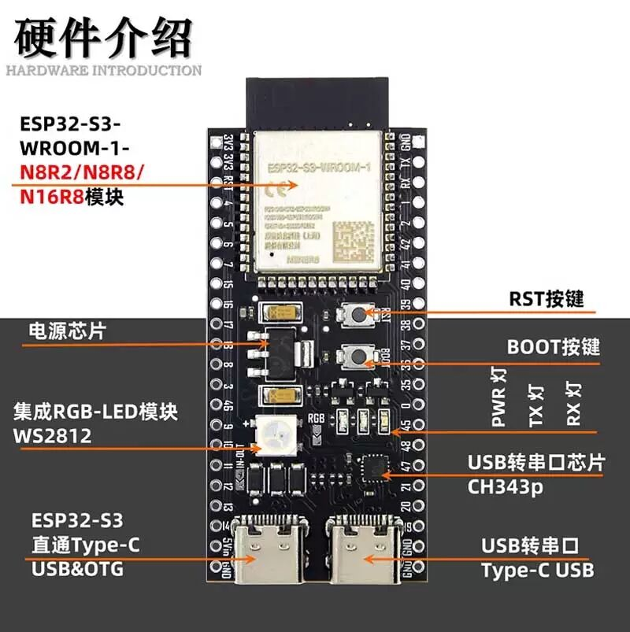
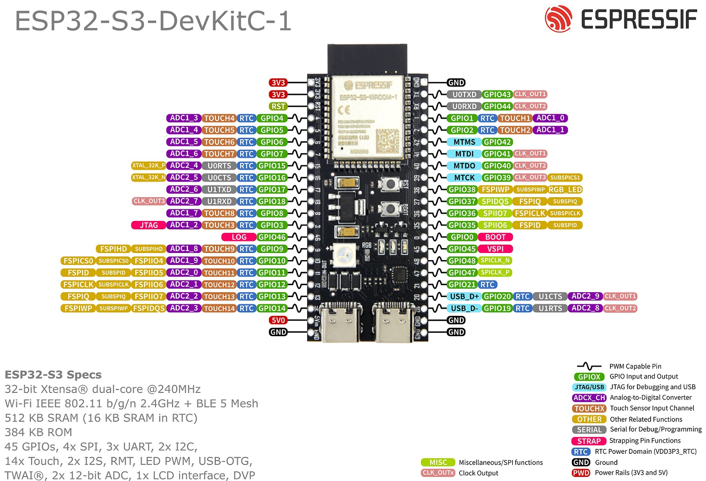
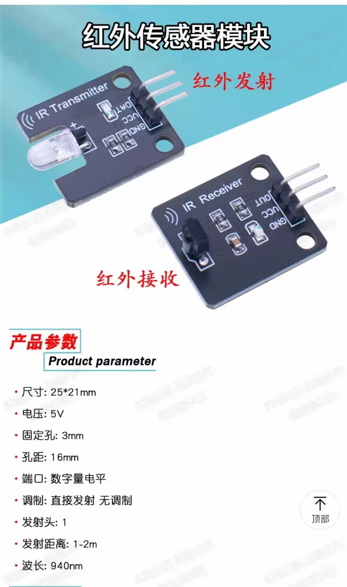
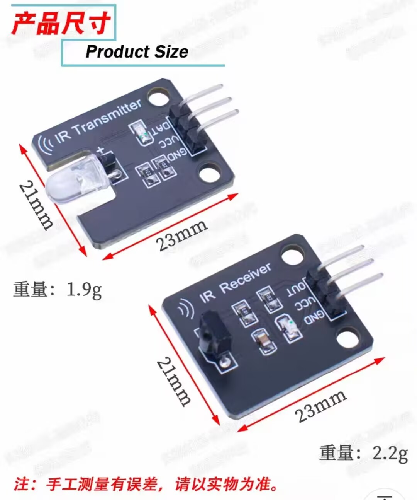
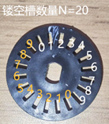

# 红外计数模块功能需求设计文档


## 一、文档目的
明确红外计数模块的功能目标、硬件方案、测试标准及集成要求，为开发、测试与集成提供依据，确保模块准确实现脉冲计数、距离计算并可靠集成到电机控制系统。


## 二、功能目标
1. 脉冲计数：检测编码盘转动脉冲，每圈对应20个脉冲（适配20个镂空槽）。
2. 距离计算：根据脉冲数及车轮直径，自动计算小车前进距离。
3. 系统集成：融入电机控制逻辑，支持“前进指定距离”指令。


## 三、硬件方案需求
### 3.1 核心硬件及参数
| 模块         | 关键参数                                                                 |
|--------------|--------------------------------------------------------------------------|
| ESP32-S3开发板 | 双核240MHz，45个GPIO（支持PWM、中断），3.3V供电，兼容ESP-IDF v4.4+       |
| 红外发射模块 | 5V供电，940nm波长，需38kHz PWM驱动，带信号指示LED                       |
| 红外接收模块 | 5V供电，输出数字电平（高≥2.5V/低≤0.5V），响应时间≤10μs                 |
| 编码盘及车轮 | 编码盘20个镂空槽；车轮直径66mm（周长≈207.24mm）                         |

#### 3.1.1 ESP32-S3开发板  
ESP32-S3-DevKitC-1开发板是整个系统的控制核心，主要负责驱动各模块工作并处理信号。其关键参数如下：  
- 处理器：Xtensa® 32位双核处理器，主频最高240MHz  
- 无线功能：支持Wi-Fi IEEE 802.11 b/g/n（2.4GHz）和BLE 5 Mesh  
- 存储资源：512KB SRAM（含16KB RTC SRAM）、384KB ROM  
- 接口资源：45个GPIO引脚，支持PWM、UART、I2C、SPI等多种外设接口；所有GPIO均可配置中断（支持双边沿触发）；集成USB-OTG功能  
- 电源：工作电压3.3V，可通过Type-C接口供电  
- 其他：板载RGB-LED（WS2812）、RST和BOOT按键、CH343P USB转串口芯片  

  
  


#### 3.1.2 红外模块  
红外模块包含发射和接收两部分，用于检测编码盘转动产生的脉冲信号，关键参数如下：  

| 子模块   | 关键参数                                                                 |
|----------|--------------------------------------------------------------------------|
| 红外发射 | 工作电压：5V；尺寸：25×21mm；固定孔直径3mm，孔距16mm；发射距离1-2m；波长940nm；带发射信号指示LED；需通过程序进行波形调制；输出为数字量电平 |
| 红外接收 | 工作电压：5V；尺寸：23×21mm；固定孔直径3mm，孔距16mm；输出为数字量电平（高电平≥2.5V，低电平≤0.5V）；响应时间≤10μs；输入阻抗≥10kΩ |

> 注：红外发射与接收模块的工作频率待后续通过示波器测量确定。  

  
  


#### 3.1.3 编码盘及车轮  
编码盘随车轮同步转动，通过遮挡/透过红外信号产生脉冲，配合车轮参数实现距离测量，关键参数如下：  


编码盘镂空槽数N = 20个（均匀分布，每圈红外接收模块收到20个脉冲信号）
  

车轮直径D = 66mm（多次测量取平均值）；周长：π×66mm≈207.24mm(π取3.14)


### 3.2 引脚配置
- 红外发射：连接支持PWM的GPIO（如GPIO18，无冲突即可）。
- 红外接收：连接支持中断的GPIO（如GPIO17，无冲突即可）。


## 四、详细功能需求
### 4.1 脉冲计数
- 触发方式：接收模块电平双边沿跳变时计数+1。
- 精度：每圈脉冲数20±1（手动转动测试）。
- 性能：支持每秒200个脉冲（车轮每秒10圈）无丢失。
- 支持软件重置计数（归零）。

### 4.2 距离计算
- 公式：总距离 = 脉冲数 ×（π×车轮直径 / 20）。
- 校准：提供`SetWheelDiameter(float diameter)`接口（直径范围5-7cm）。
- 精度：计算距离与实际距离误差≤5%（0-5米范围）。
- 实时性：更新频率≥100Hz（每10ms更新）。

### 4.3 电机控制集成
- 接口：`MoveDistance(float distance, int speed)`，参数为距离（0-5米）、速度（0-255）。
- 逻辑：启动电机→实时监测距离→到达目标±5%误差范围时停止。
- 反馈：返回执行结果（如“已前进X米”）或错误信息（如“电机未响应”）。
- 中断：支持急停信号强制停止电机并重置计数。


## 五、调试日志规范
### 5.1 记录时机
- 模块初始化成功/失败时
- 关键参数（如车轮直径）配置/修改时
- 脉冲计数变化（每10ms或每10个脉冲）时
- 距离计算结果异常（误差＞5%）时
- 函数调用成功/失败时
- 超时、中断触发等异常情况时

### 5.2 日志示例
```
// 初始化
I (1234) IR_ENCODER: IR encoder initialized successfully (TX:GPIO18, RX:GPIO17)
E (1235) IR_ENCODER: PWM init failed (check pin conflict)

// 脉冲与距离
I (1567) IR_ENCODER: Pulse count: 10 (累计: 10)
I (2345) MOTOR_CONTROL: Current distance: 0.10m (target: 1.00m)
I (3456) MOTOR_CONTROL: Reached target: 1.02m (error: 2%)

// 错误与警告
W (4567) IR_ENCODER: Pulse count abnormal (last 3 counts: 19,21,18)
E (5678) MOTOR_CONTROL: Move timeout (target 5.0m, current 4.8m)
```

### 5.3 日志模板
| 时间戳   | 模块         | 级别   | 内容                          | 解决方案                  |
|----------|--------------|--------|-------------------------------|---------------------------|
| 12:30:45 | IR_ENCODER   | ERROR  | 初始化失败                    | 检查引脚连接/是否被占用   |
| 12:31:20 | IR_ENCODER   | WARNING| 脉冲计数波动大                | 加固编码盘/调整红外对准   |
| 12:32:15 | MOTOR_CONTROL| INFO   | 成功移动1.0米（误差1.2%）     | -                         |


## 六、测试步骤与文档完善
### 6.1 硬件连接测试
- **目标**：验证发射/接收模块连接正确性
- **步骤**：
  1. 按设计连接发射模块到GPIO18、接收模块到GPIO17。
  2. 上电后查看日志是否输出“IR encoder initialized successfully”。
  3. 手动遮挡红外信号，观察日志是否有脉冲计数更新。
- **文档记录**：
  - 实际使用的引脚号及接线示意图。
  - 初始化结果及异常排查过程。

### 6.2 脉冲计数准确性测试
- **目标**：验证脉冲数与编码盘转动匹配度
- **步骤**：
  1. 手动转动车轮完整1圈，记录脉冲计数（应为20±1）。
  2. 重复测试5次，计算平均误差。
- **文档记录**：
  - 每次计数结果、平均误差、最大误差。
  - 影响准确性的因素（如编码盘松动、红外对准偏差）。

### 6.3 距离计算准确性测试
- **目标**：验证计算距离与实际距离一致性
- **步骤**：
  1. 地面标记1米距离，控制小车指令移动1米。
  2. 测量实际移动距离，计算误差（若＞5%，调用`SetWheelDiameter`校准）。
- **文档记录**：
  - 初始直径、误差；校准后直径、误差。
  - 校准前后的对比数据。

### 6.4 集成测试
- **目标**：验证与电机控制的协同工作
- **步骤**：
  1. 调用`MoveDistance`测试不同参数（0.5米/速度50、3米/速度200、5米/速度255）。
  2. 检查小车是否在目标距离±5%内停止。
- **文档记录**：
  - 各测试用例的参数、结果、误差。
  - 异常情况（如超时、过冲）及解决方案。


## 七、集成需求
1. 代码封装：红外逻辑封装为`Encoder`类（`main/motor/encoder.h`/`.cc`），符合Google C++风格。
2. 模块关联：`MotorControl`类添加`Encoder`成员，通过`Init()`初始化，关联电机启停与计数逻辑。
3. 工具注册：`MotorControl::InitializeTools()`注册“前进指定距离”工具，输入`distance`（0-5米）和`speed`（0-255），输出执行结果。
4. 兼容性：无冗余依赖，固件增大≤10KB，兼容现有ESP-IDF框架。


## 八、验收标准
1. 功能达标：脉冲计数每圈20±1，距离误差≤5%，集成指令正常执行。
2. 测试通过：硬件/功能/集成测试100%通过，抗干扰测试误计数≤1次/1000圈。
3. 代码合规：符合风格规范，无编译错误，连续运行24小时稳定。
4. 文档完整：包含接线图、校准说明、接口示例。


## 九、后期优化建议
1. **抗干扰**：软件滤波（连续2次跳变计数）、硬件加100nF滤波电容。
2. **精度提升**：脉冲细分（上升/下降沿分别计数）、温度补偿车轮直径。
3. **功能扩展**：计算实时速度（距离/时间）、实现速度闭环控制。
4. **可靠性**：添加脉冲丢失检测、 watchdog定时器防卡死。